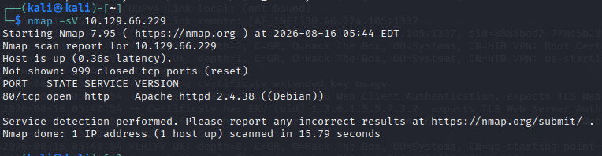
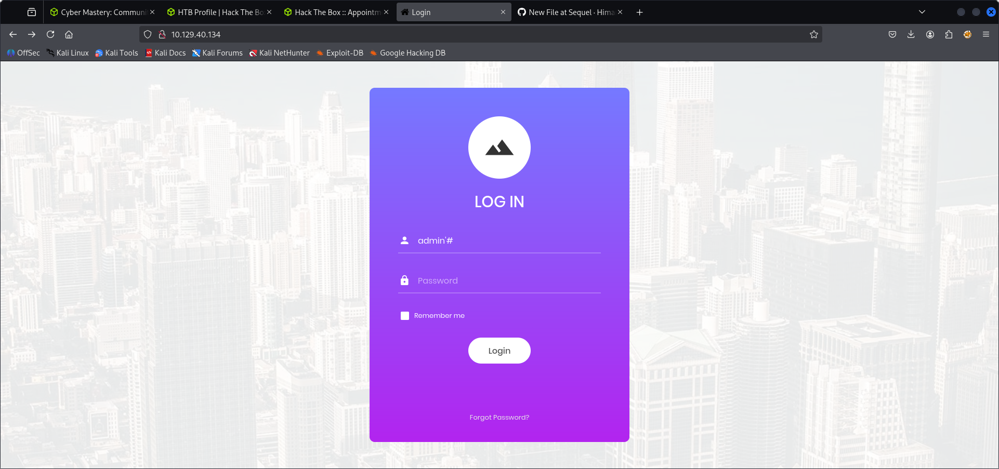
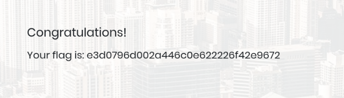

# APPOINTMENT - HACK THE BOX
## 1. Reconnaissance
I used nmap to scan the target ip then i found port 80  was open and web service running on it.
 command i used for scaning nmap -sV <target IP >
 
 

## 2. WEB 
I opened the ip address in the browser.
I found the login page.

## 3. FLAG 
I tested the login page and found the credentials way to access the page. 
AFTER login i found the flag 

## WHAT I LEARNED 
1. How to find open port using nmap.
2. How to enumerate a web application.
3. How to find flag.
