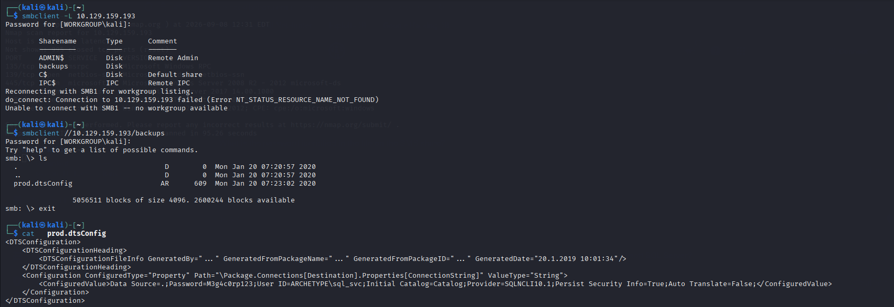
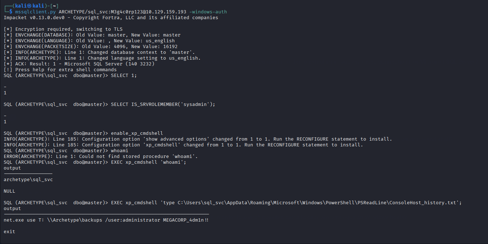
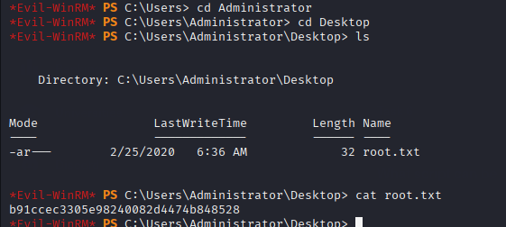

## SCANNING
I scanned the target ip with NMAP and i found several ports open and the imp port was smb 445 and Microsoft SQL Server mssql 1433  

# SMB ENUMERATION
Checked the smb share files. Anonymous access allowed and backups share file discovered.
connected to the share file and listed the file 
A file name prod.dtsConfig was found then i downloaded the file. 
I opened that file and found the credentials for Microsoft sql and the important information was user and password of the sql_svc account.
impacket-mssqlclient ARCHETYPE/sql_svc@<TARGET_IP> -windows-auth

After entering the password, an MSSQL shell was obtained:

SQL>

Checked whether the account had sysadmin privileges:

confirmed that sql_svc had sysadmin privileges.

 Command Execution Through MSSQL

Since the account had sufficient privileges, xp_cmdshell could be enabled.

EXEC sp_configure 'show advanced options', 1;
RECONFIGURE;

EXEC sp_configure 'xp_cmdshell', 1;
RECONFIGURE;

Tested Windows command execution:

EXEC xp_cmdshell 'whoami';

This allowed commands to be executed on the underlying Windows machine.

# Finding Administrator Credentials

Enumerated the sql_svc user's PowerShell history.

The relevant file was:

C:\Users\sql_svc\AppData\Roaming\Microsoft\Windows\PowerShell\PSReadLine\ConsoleHost_history.txt

The PowerShell history contained credentials for the Administrator account.

Administrator Access

Since WinRM (port 5985) was available, Evil-WinRM could be used with the recovered Administrator credentials:

evil-winrm -i <TARGET_IP> -u Administrator

After authentication:

*Evil-WinRM* PS C:\Users\Administrator\Documents>
 
 

 # Flag 
 After obtaining Administrator access:
 i got the flag and another flag was locate on sql_svc user's desktop which
 
 
 
