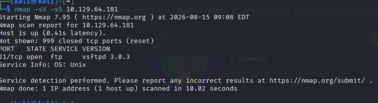
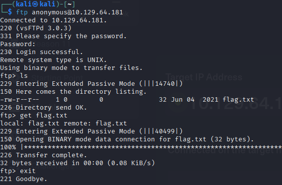
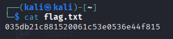

# Fawn - Hack The Box
## 1. Enumeration
First i scanned the target IP using nmap to find open ports and service. then i found 21 open port and ftp running.

## 2. Ftp Enumeration
I connected to ftp service   

The server allowed anonymous login.
username : anonymous 
password : anonymous
After logging i listed the file using ls command 
and then found that file with name of 'flag.txt' then i downloaded it using get command 
## Flag
After that i opened it using cat command and got that flag 

## What I Learned
1. How to identify FTP using Nmap.
2. How to connect to an FTP server.
3. What anonymous FTP login is.
4. How to list and download FTP file from FTP server.
