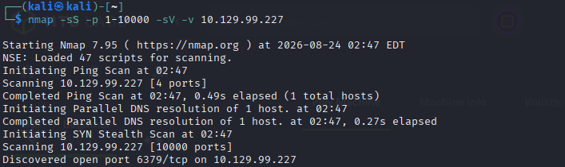
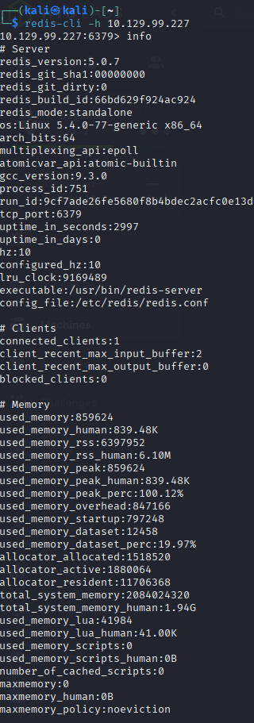
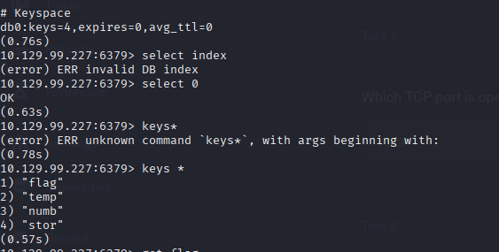

## REDEEMER  
# ENUMERATION 
So here first i scanned  the target ip with the help of Nmap.i found the open port and Redis server running. Redis version was not shown but i knew the port number. so i identified that  it was the redis server 

# REDIS ENUMERATION
I connected the Redis service using Redis-cli and -h mean host/ip 

After connecting, i checked the availabel information in Redis  using info  and found  the key 

# Flag 
I found key containing the information.
I used get key 
and flag  was displayed in the output

# What I Learned 

1. How to identify  Redis using Nmap.
2. How to connect to a Redis server.
3. How to enumerate a Redis.
4. How to find key retrieve their values.
