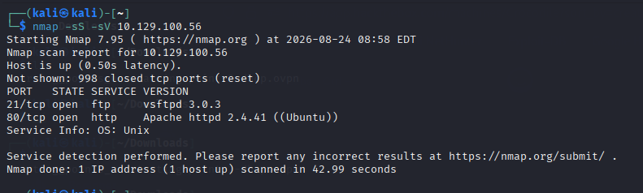
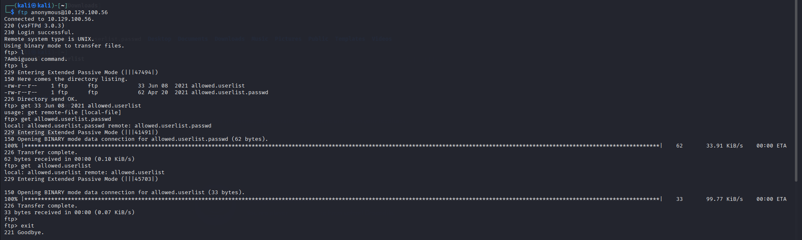
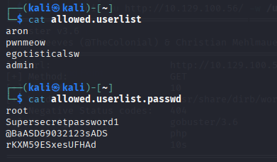
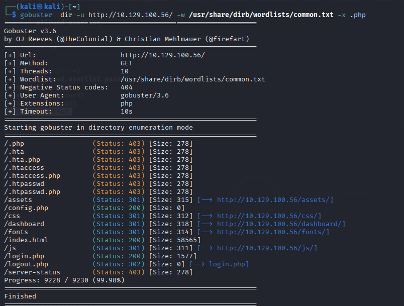

## CROCODILE 
# ENUMERATION
I scanned the target IP with help of Nmap found two open ports  and one of them was FTP. 

## FTP Enumeration 
I found ftp running then i connected to ftp server then i checked available information. found two user and password file.
I downloaded it from server using get command.

 
 Then i opened those file and i got  credentials like username and password in that file.
 
 

 # WEB ENUMERATION 
 I opened the web service in the browser 
 Then i used Gobuster to enumerate the web server  and  found hidden files and directories.
 Gobuster found  login.php.
 Then i opened it in broswer and found login page.
 
 

 After that i used the credentials that i found during ftp enumeration and after logging in i got access and flag.
 
 # What I Learned
 1. How to identify the ftp port port using Nmap.
 2. How to an enumerate FTP server.
 3. How to enumerate the web server and find hidden file with gobuster.
 4. How to discovered  credentials to access web application.
 
